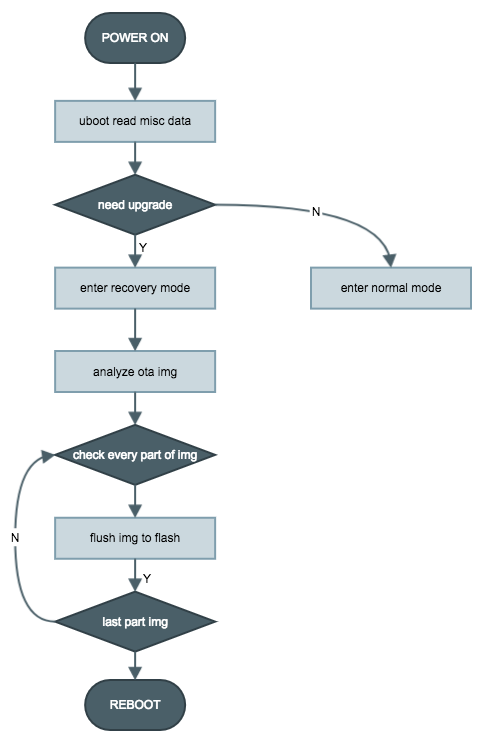

# 系统升级

RoKidOS 为第三方厂商提供了 OTA 相关方案。

## 系统分区

由于文件系统的问题，线刷的固件包为**aml_upgrade_package.img**，而ota所使用的固件包为**rokid_upgrade_package.img**，二者打包格式不同在于system分区的不同。

对于采用Amlogic公司芯片方案，系统分区如下:

1. uboot;
2. dtb (隐藏分区)；
3. misc;
4. boot(kernel);
5. recovery;
6. data;
 

如果开发者或者第三方厂商需要修改系统分区，需要修改分区大小，则需要更改kernel代码dts和对应uboot代码。以A113版本来讲，其余开发板请参考[开发板列表](../../reference/dev_board/board_list.md),对应代码路径如下：

```shell
# dts

kernel/aml-4.9/arch/arm64/boot/dts/rokid/banban_m_a113.dts

# uboot

board/amlogic/axg_s420_v1/axg_s420_v1.c
```

## 升级流程
流程图如下：



具体ota操作分析如下：

1. 设备通过网络协议获取网络ota升级包(rokid_upgrade_package.img)，存储在data分区；并设置升级参数到misc分区后设备reboot,具体参数如下：
2. 重启后，进入uboot状态，uboot读取misc分区的标志位，如果判断是升级模式，会把recovery 加载到 内存中，跳转到recovery分区，并修改bootcmds。
3. recovry分区相当于linux内核+ramfsdist，启动init进程，读取bootcmds，后会执行打包在ramfslist中ota_update进程；
4. ota_update进程会挂载data分区，后读取boot_cmd结构体，开始解析升级包，以此烧写到对应分区，烧写完成后，重启设备；


