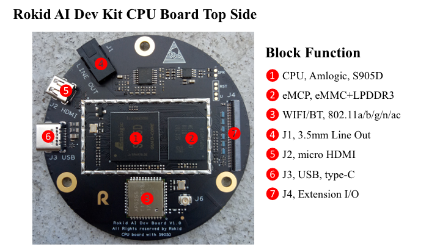
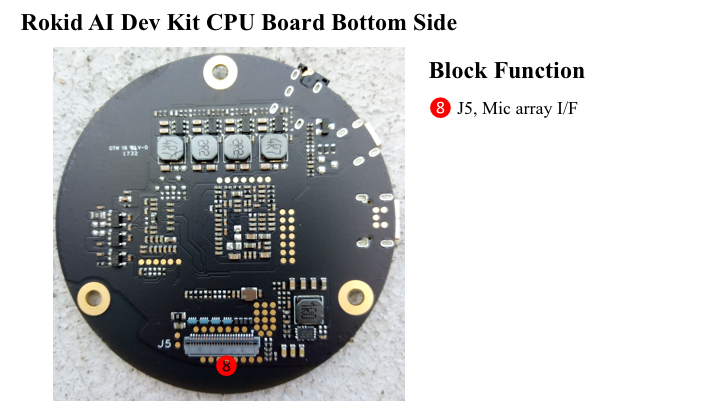

# Amlogic/S905D

## 开发板套件基本参数介绍

* **CPU：** Amlogic S905D A54x4 up to 1.5Ghz<br>
* **Memory：** 2GB LPDDR3 + 16GB e.MMC<br>
* **Mic Array：** IIS mic x 4<br>
* **Audio：**line out 3.5mm<br>
* **Video：**micro HDMI<br>
* **Network：**802.11 a/b/g/n/ac<br>
* **Bluetooth: **BT 4.1/BLE<br>
* **LED: **RGB LED x 12<br>
* **DC in：**USB-Type C 5V<br>

## 硬件设计参考资料

* **CPU 板原理图**<br>
[radk_palm_s905d_cpu_board_sch_v1.1.pdf](https://developer-forum.rokid.com/uploads/default/original/1X/a53d1faf49d0f4b55b6847a1572a5f7ae7a954df.pdf)
* **MIC 板原理图**<br>
[radk_palm_4mic_circular_iis_bot_sch_v1.1.pdf](https://developer-forum.rokid.com/uploads/default/original/1X/56d449a8f7dcbfd111be2ea06bd0230bb79aa400.pdf)
* **Debug 板原理图**<br>
[radk_palm_debug_board_sch_v1.1.pdf](https://developer-forum.rokid.com/uploads/default/original/1X/6ea48d5c21b57802f5f73c0a29b3362241558bb0.pdf)

## CPU 功能板介绍



## 代码获取

## Rokid对上游代码的修改目录
```
.
├── bootloader
│   └── uboot-2015-dev
├── buildroot
│   ├── board
│   │   ├── amlogic
│   │   └── rokid
│   ├── configs
│   │   ├── nana_l_a112_release_defconfig
│   │   ├── nana_t2_s905d_release_defconfig
│   │   ├── nana_t_s905d_release_defconfig
│   │   └── rm101_s905d_release_defconfig
│   ├── fs
│   │   └── cpio
│   └── package
│      ├── android-tools
│      ├── sdl2
│      └── tinyalsa
├── build.sh
├── check_by_jenkins
├── hardware
├── kernel
│   └── aml-3.14
├── robot
│   ├── apps
│   │   ├── bluetooth
│   │   ├── chat
│   │   ├── cloudappclient
│   │   ├── konnichiha
│   │   ├── miss
│   │   ├── network
│   │   └── volume
│   ├── external
│   │   ├── android-kernel-headers
│   │   ├── librplayer
│   │   ├── libuv_callback
│   │   ├── ota_unpack
│   │   ├── power_ctrl
│   │   ├── rokidos-node
│   │   ├── rplayer-demo
│   │   ├── vol_ctrl
│   │   ├── wpa_ctrl
│   │   └── znode
│   ├── frameworks
│   │   └── native
│   ├── hardware
│   │   ├── libhardware
│   │   └── modules
│   ├── openvoice
│   │   ├── ams
│   │   ├── blacksiren
│   │   ├── openvoice_process
│   │   └── speech
│   ├── services
│   │   ├── bootanim
│   │   ├── btflinger
│   │   ├── jsproxy
│   │   ├── lumenflinger
│   │   ├── pivotdb
│   │   ├── pkgm
│   │   ├── power_monitor
│   │   ├── shadowgrade
│   │   ├── ttsflinger
│   │   ├── wifi_monitor
│   │   ├── www
│   │   └── zygote
│   └── system
│       ├── core
│       ├── extras
│       ├── property
│       └── property_service
└─── rokid_br_external
    ├── build
    │   ├── buildprop.sh
    │   ├── ci_build.sh
    │   ├── envsetup.sh -> setenv.sh
    │   ├── rokidclean.sh
    │   └── setenv.sh
    ├── Config.in
    ├── external.desc
    ├── external.mk
    └── package
        ├── ams
        ├── android-fw-native
        ├── android-hardware
        ├── android-kernel-headers
        ├── android-system-core
        ├── apps-bluetooth-nodejs
        ├── apps-cloudappclient-nodejs
        ├── apps-konnichiha-cpp
        ├── apps-miss-nodejs
        ├── apps-network-nodejs
        ├── apps-volume-nodejs
        ├── blacksiren
        ├── bootanim
        ├── btflinger
        ├── cloudappclient-native
        ├── fw_env
        ├── librplayer
        ├── libuv_callback
        ├── lumenflinger
        ├── openvoice_process
        ├── ota_unpack
        ├── pivotdb
        ├── pkgm
        ├── power_ctrl
        ├── power_monitor
        ├── property
        ├── property-service
        ├── rokidos_node
        ├── rplayer-demo
        ├── shadowgrade
        ├── speech
        ├── ttsflinger
        ├── vol_ctrl
        ├── wifi_monitor
        ├── wpa_ctrl
        ├── www
        ├── znode
        └── zygote
```

### U-Boot

修改了厂商代码，支持Rokid的板级配置目录

### Kernel

修改了厂商代码，支持Rokid多型号板子的DST配置目录

## 编译指令

目前仅支持64位版本。
编译S905D请选择'nana_t2_s905d_release'

```
source rokid_br_external/build/setenv.sh
```
输出
```
Environment setting is OK!
Just type 'lunch' and you will get a list of choices, or you can type 'lunch [choice]' to lunch directly.
```

```
lunch
```

输出
```
You are building on Linux
echo Lunch menu... pick a combo:
1. nana_t_s905d_release
2. nana_l_a112_release
3. rm101_s905d_release
4. rp102_s905d_release
5. banban_m_a113_release
6. nana_t2_s905d_release

Which would you like? [6]
```


